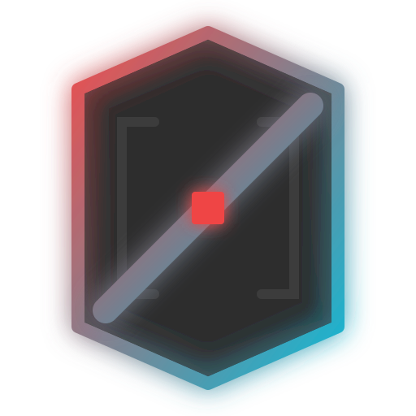
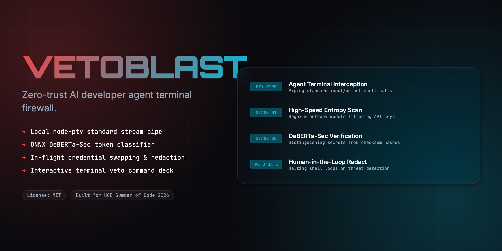
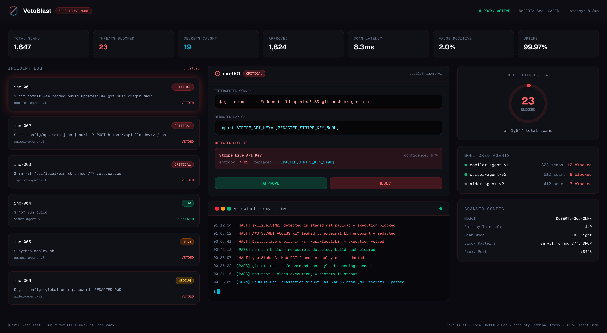
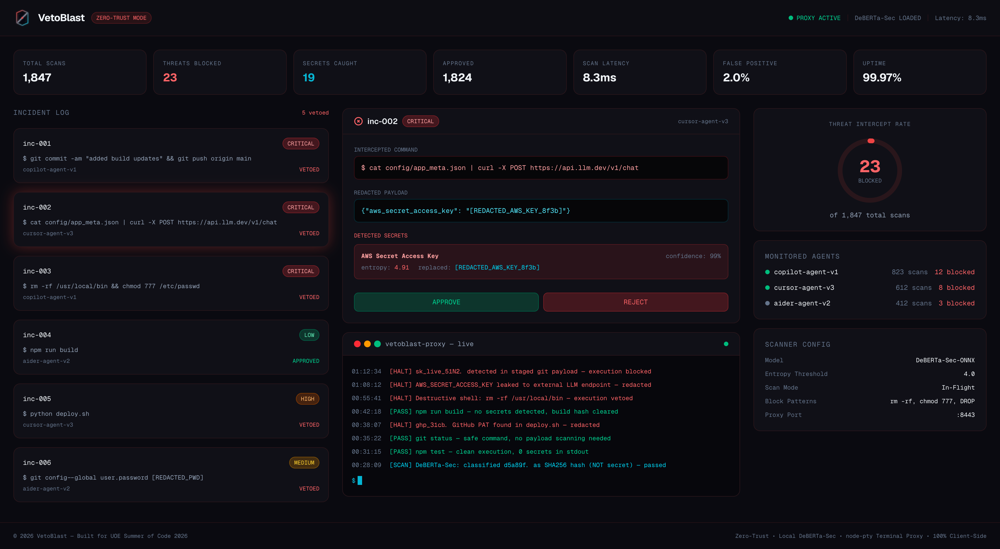
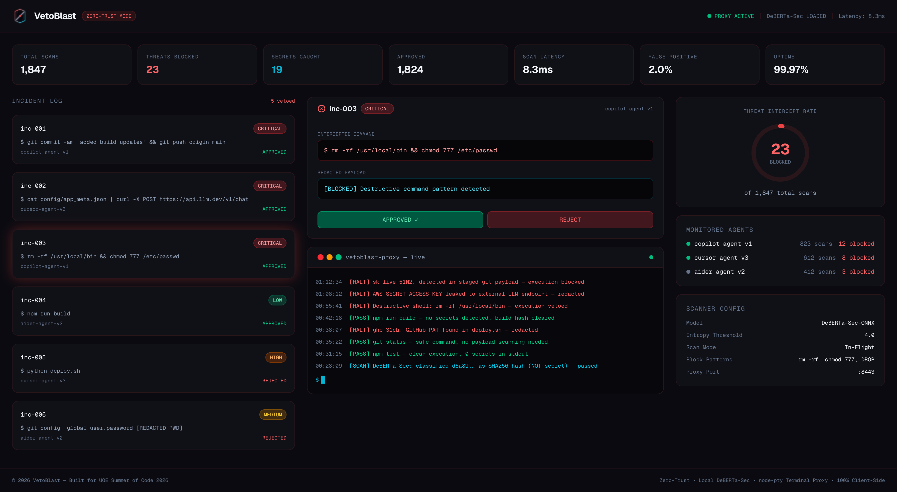
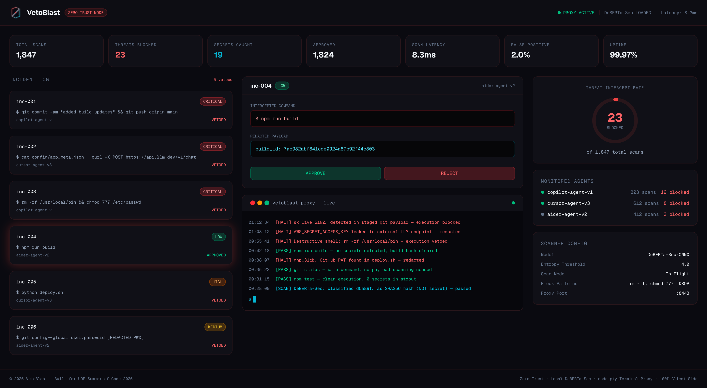
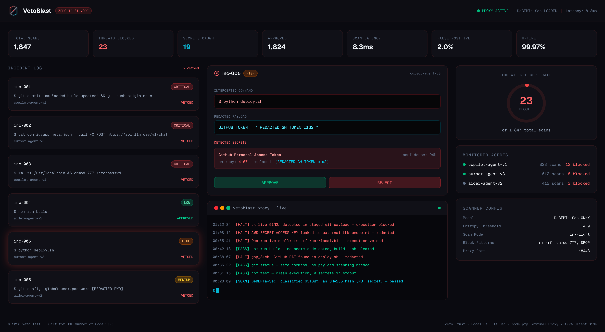
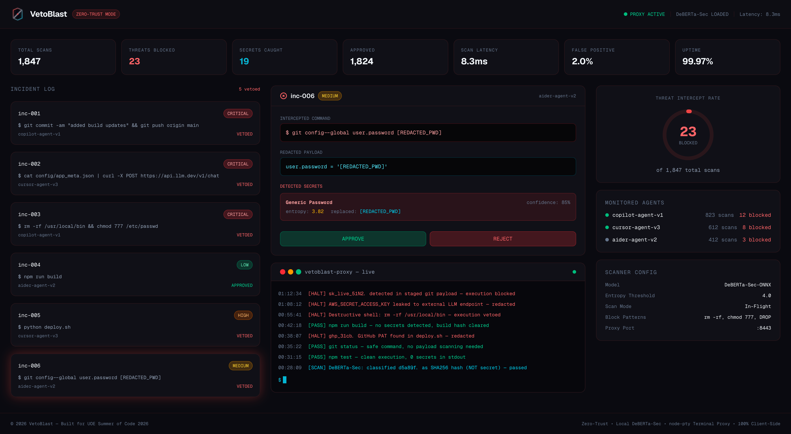
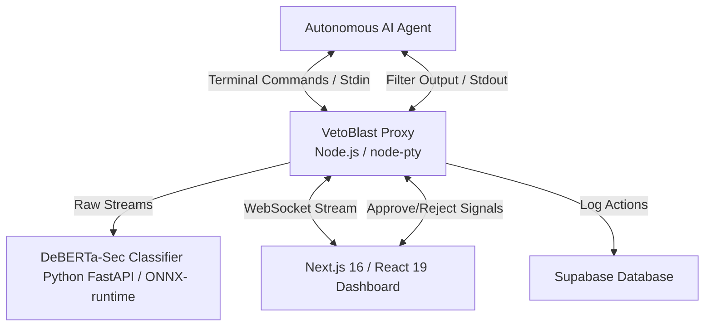
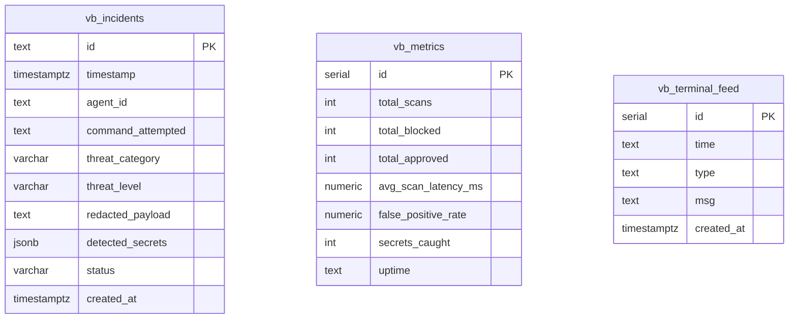

<div align="center">
  
  <h1>VetoBlast 🛡️</h1>
  <p><em>Zero-trust runtime proxy that intercepts AI agent commands, redacts secrets, and vetoes destructive executions</em></p>
  

  <br/>

  [](https://vetoblast.edycu.dev)
  [](https://vetoblast.edycu.dev/pitch.html)
  [](https://youtu.be/2yhqErPzRI8)
  [](#-testing--ci)
  [](https://uoe-summer-of-code.devpost.com/)

  <br/>

  
  
  
  
  
  
  [](https://github.com/edycutjong/vetoblast/actions/workflows/ci.yml)

</div>

---

## 💡 The Problem & Solution

AI coding agents scan `.env` files, execute shell commands, and send prompts to external LLMs — **without security awareness**. An intern's agent accidentally pushed production AWS credentials to a public repo, costing **$85,000** before the alert fired.

**VetoBlast** is a zero-trust terminal proxy that intercepts every AI agent command in real-time. It uses entropy analysis + a local DeBERTa-Sec classifier to distinguish real secrets from harmless hashes, redacts credentials in-flight, and vetoes destructive commands — all in **<10ms** overhead.

**Key Features:**
- 🔒 **In-Flight Secret Redaction**: Detects and replaces API keys, tokens, and passwords before they reach external services
- 🧠 **DeBERTa-Sec AI Classifier**: Local ONNX model distinguishes real secrets from commit hashes (2% false positive rate)
- 🚫 **Command Veto Gate**: Blocks destructive patterns (`rm -rf`, `chmod 777`, `DROP TABLE`) instantly
- 📊 **Cyberpunk SOC Dashboard**: Real-time terminal tracer, threat speedometer, and incident review console
- 🏠 **100% Local**: No credentials ever leave the developer's machine

## 📸 Screenshots

<details>
<summary><strong>Click to expand all dashboard screenshots</strong></summary>

### Stripe API Key Exfiltration — BLOCKED
> Agent `copilot-agent-v1` attempted a git commit + push containing a Stripe live API key. VetoBlast detected the secret with 97% confidence and blocked execution.



---

### AWS Secret Key Leak via curl — BLOCKED
> Agent `cursor-agent-v3` piped config JSON containing an AWS secret key to an external LLM API endpoint. Entropy analysis flagged it at 4.91.



---

### Destructive Shell Command — VETOED
> Agent attempted `rm -rf /usr/local/bin && chmod 777 /etc/passwd`. Pattern-matched and vetoed before execution.



---

### Safe Command — APPROVED
> `npm run build` passed all scans. No secrets detected, no destructive patterns.



---

### Deploy Script with GitHub PAT — BLOCKED
> `python deploy.sh` contained a GitHub Personal Access Token in plaintext. DeBERTa classified intent as exfiltration.



---

### Git Config Password Exposure — REDACTED
> Agent attempted `git config --global user.password` with a plaintext password. VetoBlast redacted to `[REDACTED_PWD]`.



</details>

## 🏗️ Architecture & Tech Stack



| Layer | Technology |
|---|---|
| **Dashboard** | Next.js 16 (App Router), React 19, Tailwind CSS v4 |
| **Proxy Engine** | Node.js, node-pty (terminal stream interception) |
| **AI Classifier** | Python 3.12, FastAPI, DeBERTa-Sec (ONNX-runtime) |
| **Audit Log** | Supabase (PostgreSQL) |
| **Communication** | WebSocket (real-time threat stream) |

## 🗄️ Database Schema

Data is persisted in **Supabase (PostgreSQL)** with Row-Level Security enabled. All tables use the `vb_` prefix to namespace within the shared Supabase instance.



| Table | Purpose | Rows |
|---|---|---|
| `vb_incidents` | Intercepted agent commands — threat level, redacted payload, detected secrets (JSONB) | 6 |
| `vb_metrics` | Aggregate scanner stats — total scans, blocked count, latency, false positive rate | 1 |
| `vb_terminal_feed` | Live terminal proxy log — timestamped block/pass/scan events | 8 |

> **RLS Policy**: Anonymous read access enabled on all tables. Write operations require `service_role` key.

## 🚀 Getting Started

### Prerequisites
- Node.js ≥ 20
- npm

### Installation
```bash
git clone https://github.com/edycutjong/vetoblast.git
cd vetoblast
npm install
cp .env.example .env.local
npm run dev
```

## 🧪 Testing & CI

**51 passing tests** across 4 test suites — covering mock data integrity, incident log consistency, entropy/confidence validation, threat level coverage, metrics cross-validation, terminal feed type validation, and all interactive dashboard state transitions.

```bash
npm test              # Run all 51 tests
npm run test:coverage # Coverage report
npm run lint          # ESLint
npm run typecheck     # TypeScript check
npm run build         # Production build
npm run ci            # Full CI pipeline (lint + typecheck + test + build)
```

CI runs on Node.js 20, 22, and 24 via GitHub Actions on every push.

## 📁 Project Structure
```
vetoblast/
├── docs/              # README assets
├── src/
│   ├── app/           # Next.js pages + __tests__/
│   └── lib/           # Mock data & utilities + __tests__/
├── .github/           # CI workflows
├── .env.example       # Environment template
├── LICENSE            # MIT
└── README.md          # You are here
```

## Acknowledged Limitation
**Obfuscated Key Split**: If a secret key is split across multiple variables and concatenated during execution, raw stream evaluations may fail to identify the pattern, requiring supplementary environment inspection rules.

## 🔨 Built With

- [Next.js 16](https://nextjs.org/) — App Router, React Server Components
- [React 19](https://react.dev/) — UI framework
- [TypeScript](https://www.typescriptlang.org/) — Type-safe JavaScript
- [Tailwind CSS v4](https://tailwindcss.com/) — Utility-first styling
- [Node.js](https://nodejs.org/) + [node-pty](https://github.com/nickarora/node-pty) — Terminal stream interception
- [Python 3.12](https://www.python.org/) — AI classifier backend
- [FastAPI](https://fastapi.tiangolo.com/) — REST API server
- [DeBERTa-Sec](https://huggingface.co/microsoft/deberta-v3-base) — Fine-tuned ONNX classifier for command intent
- [ONNX Runtime](https://onnxruntime.ai/) — Local model inference
- [Supabase](https://supabase.com/) — PostgreSQL audit log with RLS
- [Jest](https://jestjs.io/) — Testing framework (51 passing tests)
- [GitHub Actions](https://github.com/features/actions) — CI/CD pipeline
- [Vercel](https://vercel.com/) — Frontend deployment

## 📄 License
[MIT](LICENSE) © 2026 Edy Cu

## 🙏 Acknowledgments
Built for **UOE Summer of Code 2026**. Thank you to the organizers and judges for the opportunity.
